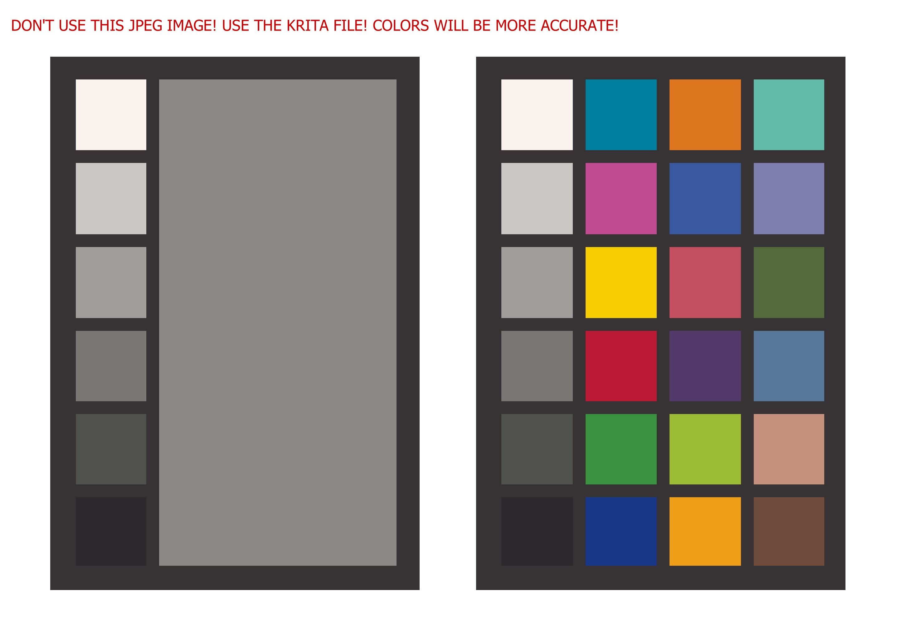

# SpyderX's Color Checkr24 Chart
The digital version of SpyderX's color chart that comes with the SpyderX Photo Kit.

I wanted something like this image, with correct colors, but couldn't find it anywhere on the DataColor website, or anywhere online, so I created one myself. The values from the sRGB column were used (not the Adobe RGB or Lab columns).

This image is based off of this document: [SpyderCheckr_Color_Data_V2.pdf](https://www.mathworks.com/matlabcentral/answers/uploaded_files/321850/SpyderCheckr_Color_Data_V2.pdf)

The spreadsheet is based off of this page (but I fixed some typos that the website had, so my spreadsheet should be more accurate than this web page): [Color Definitions](https://www.bartneck.de/2017/10/24/patch-color-definitions-for-datacolor-spydercheckr-48/)

Use at your own risk.

Tags: Macbeth, ColorChecker, Color, Colour, Checker, Checkr, Card, Sheet, Spyder, SpyderX, Datacolor, Chart, Photo Kit, DisplayCAL, Image, PNG, JPEG, JPG, Match, Krita, Photoshop